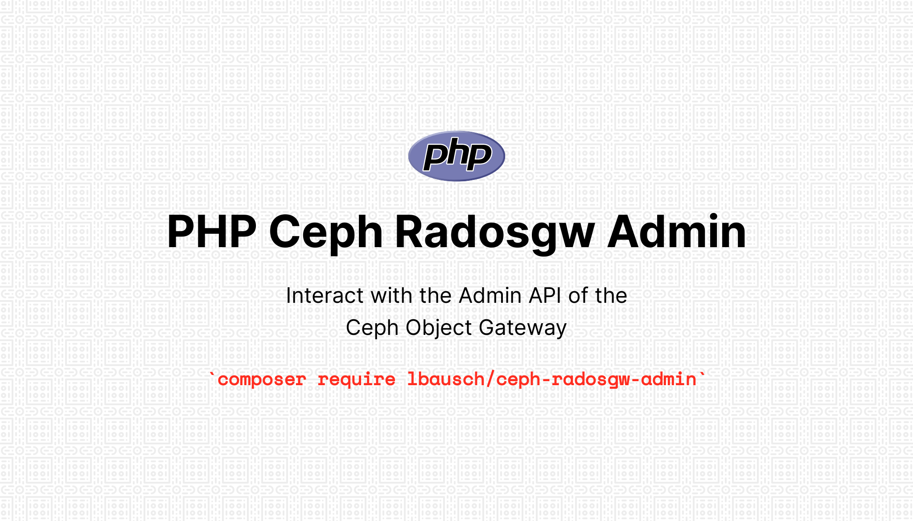

# PHP Ceph Radosgw Admin <!-- omit in toc -->

  

A PHP REST client for the [Ceph](https://ceph.io/) [Object Gateway](https://docs.ceph.com/en/latest/radosgw/) [Admin Ops API](https://docs.ceph.com/en/latest/radosgw/adminops/)

- [Features](#features)
- [Requirements](#requirements)
- [Installation](#installation)
- [Usage](#usage)
  - [Admin Client](#admin-client)
  - [Handling Exceptions](#handling-exceptions)
  - [S3 Client](#s3-client)
  - [Custom Configuration](#custom-configuration)

## Features
+ Supports all endpoints of the [Admin Ops API](https://docs.ceph.com/en/latest/radosgw/adminops/), including currently undocumented `metadata/` endpoints
+ Requests are signed using AWS Signature V2 and V4
+ Provides S3 client with no extra configuration by utilizing the [AWS SDK for PHP
](https://aws.amazon.com/sdk-for-php/)
+ Extensible and customizable

## Requirements
+ PHP ^7.4 or PHP ^8.0
+ Ceph Nautilus (14) or newer

## Installation
Use [Composer](https://getcomposer.org/) to install the library:
```bash
composer require lbausch/ceph-radosgw-admin
```

On the Ceph side an admin user with sufficient capabilities is required:

```bash
radosgw-admin user create \
    --uid="admin" \
    --display-name="Admin User" \
    --admin \
    --caps="users=read,write;usage=read,write;buckets=read,write;metadata=read,write;zone=read,write" \
    --access-key="<redacted>" \
    --secret="<redacted>"
```

## Usage

### Admin Client
```php
use LBausch\CephRadosgwAdmin\Client;

require 'vendor/autoload.php';

$client = Client::make('http://gateway:8080', 'access key', 'secret key');

$response = $client->bucket()->list();

print_r($response->get());

/*
Array
(
    [0] => mybucket
)
*/
```

### Handling Exceptions
Upon failed requests the exception `LBausch\CephRadosgwAdmin\ApiException` is thrown.

```php
use LBausch\CephRadosgwAdmin\ApiException;
use LBausch\CephRadosgwAdmin\Client;

require 'vendor/autoload.php';

$client = Client::make('http://gateway:8080', 'access key', 'secret key');

try {
    $client->user()->remove('non existent user');
} catch (ApiException $exception) {
    // Exception handling
}

```

### S3 Client
```php
use LBausch\CephRadosgwAdmin\Client;

require 'vendor/autoload.php';

$client = Client::make('http://gateway:8080', 'access key', 'secret key');

$s3client = $client->getS3Client();

// Use different credentials
// $s3client = $client->getS3Client('different access key', 'different secret key');

// Pass arbitrary options to S3 client
// $s3client = $client->getS3Client('different access key', 'different secret key', [
//     'http' => [
//         'verify' => false,
//     ],
// ]);

// Create a bucket
$s3client->createBucket([
    'Bucket' => 'mybucket',
]);

// List all buckets
$buckets = $s3client->listBuckets();

foreach ($buckets['Buckets'] as $bucket) {
    echo $bucket['Name'].PHP_EOL; // mybucket
}

// Put an object in the bucket
$s3client->putObject([
    'Bucket' => 'mybucket',
    'SourceFile' => 'foobar.png',
    'Key' => 'foobar.png',
]);
```

### Custom Configuration
Many settings may be overriden if needed. See `LBausch\CephRadosgwAdmin\Config::defaults()` for a list of configurable options.

```php
use LBausch\CephRadosgwAdmin\Client;
use LBausch\CephRadosgwAdmin\Config;

require 'vendor/autoload.php';

$config = Config::make([
    // Set a custom admin path
    'adminPath' => 'mgt/',
]);

// Override settings after instantiation, e.g. specify a timeout for requests
$config->set('httpClientConfig', [
    'timeout' => 10,
]);

$client = Client::make('http://gateway:8080', 'access key', 'secret key', $config);
```
